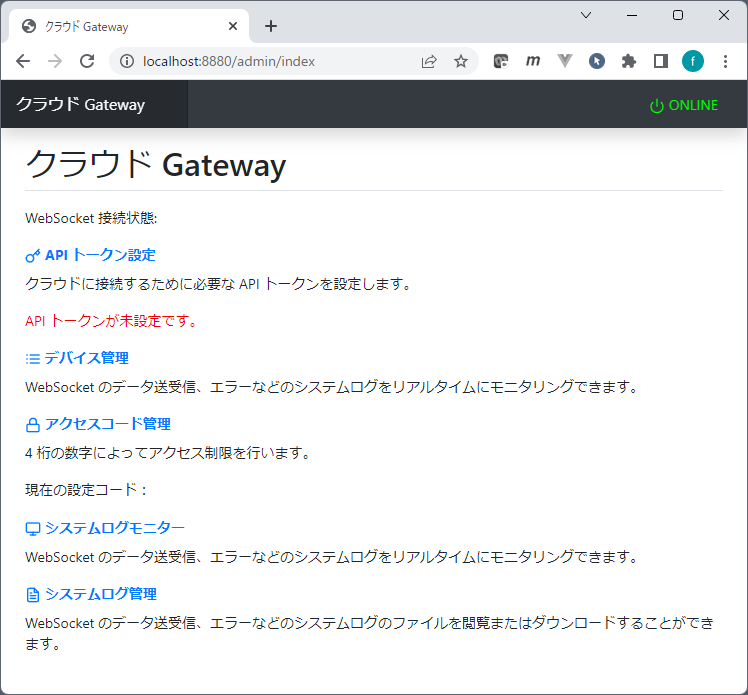
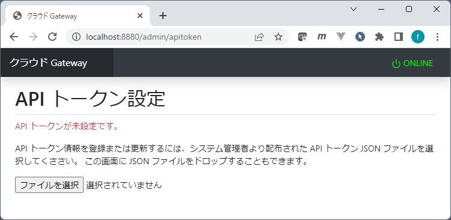
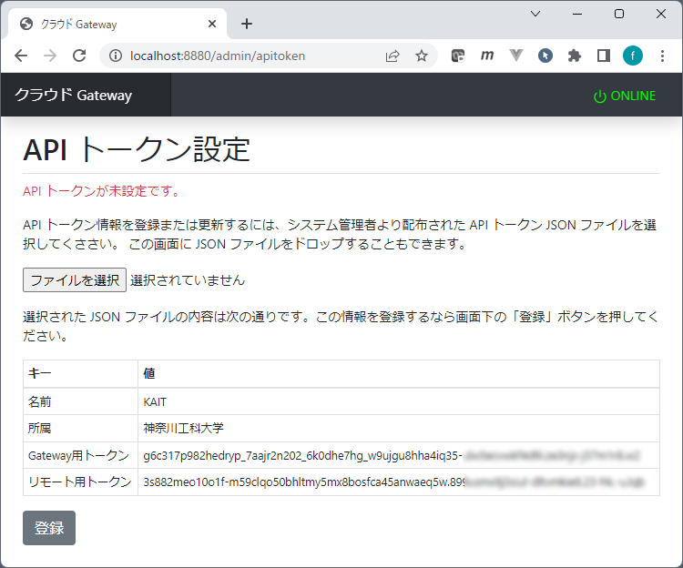
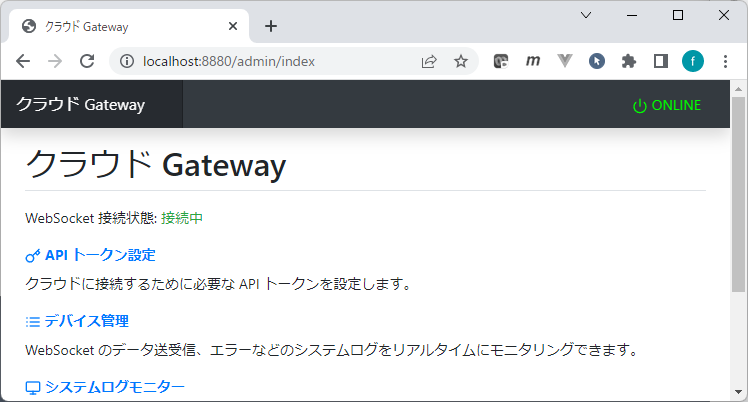
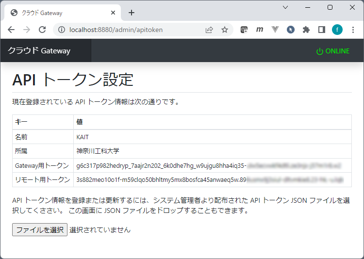
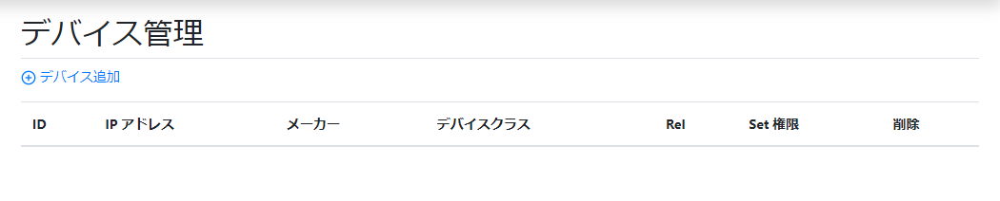
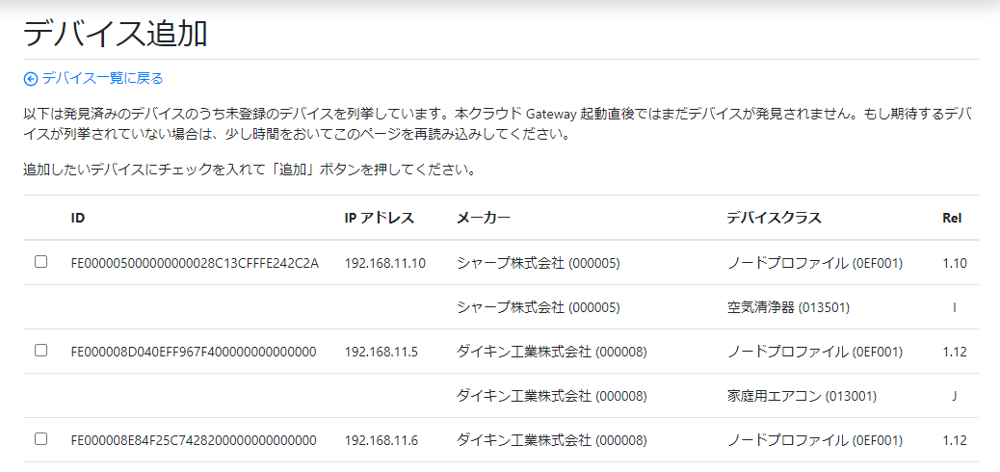
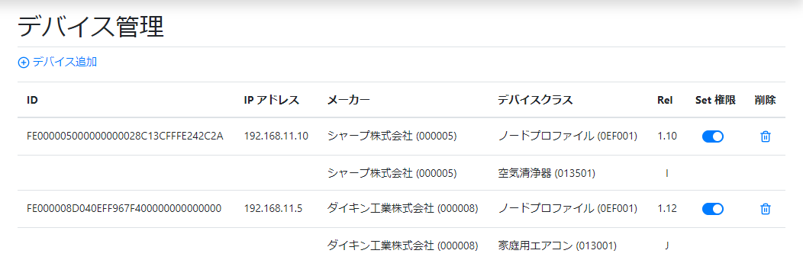
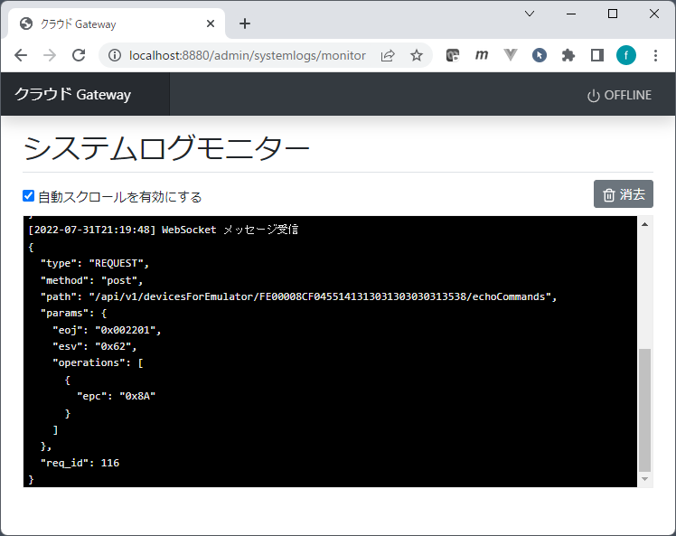
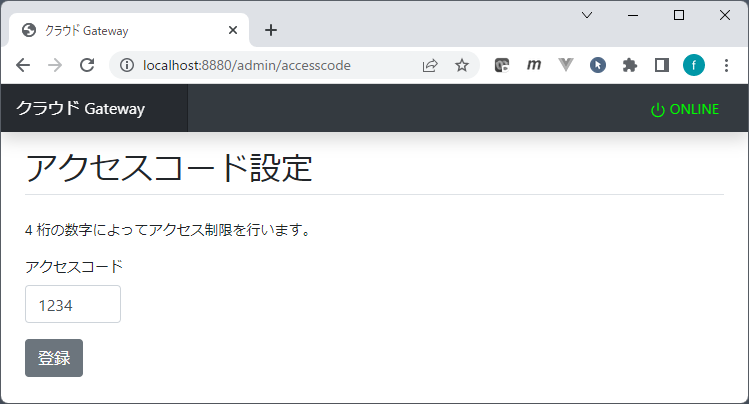

# kws-cloud-gateway
 実証システム - クラウドGateway

## 目次

- [動作環境構築](#env)
- [起動方法](#start)
- [API トークン設定](#token)
- [デバイス管理](#device)
- [Set 権限](#permission-set)
- [動作確認](#req-examples)
- [オフラインモード](#offline)
- [システムログモニター](#log-monitor)
- [アクセスコード](#access-code)

-----

## <a id="env">動作環境構築</a>

Windows 11 および Raspberry OS での動作を確認しています。

- [node.js](https://nodejs.org/ja/) v16 以上
- Node モジュール
  - [websocket](https://www.npmjs.com/package/websocket)
  - [express](https://www.npmjs.com/package/express)
  - [http-errors](https://www.npmjs.com/package/http-errors)
  - [ejs](https://www.npmjs.com/package/ejs)
  - [csrf](https://www.npmjs.com/package/csrf)
  - [express-session](https://www.npmjs.com/package/express-session)
  - [session-file-store](https://www.npmjs.com/package/session-file-store)
  - [cookie-parser](https://www.npmjs.com/package/cookie-parser)

クラウド Gateway 本体のディレクトリ `kws-cloud-gateway` をお好きなディレクトリ内にコピーしてください。以下、`/home/pi/` 直下に `kws-cloud-gateway` ディレクトリを設置した前提で説明します。

`kws-cloud-gateway` に `cd` してください。そして、次のコマンドで必要な node モジュールをまとめてインストールしてください。

```
$ npm install
```

もし個別に node モジュールをインストールする場合は、次のコマンドを実行してください。

```
$ npm install websocket
$ npm install express
$ npm install http-errors
$ npm install ejs
$ npm install csrf
$ npm install express-session
$ npm install session-file-store
$ npm install cookie-parser
```

## <a id="start">起動方法</a>

クラウド Gateway は次のように起動してください。

```
$ cd /home/pi/kws-cloud-gateway
$ node start.js --enable-debug
```

スイッチオプション `--enable-debug` を付けると、コンソールに処理内容をリアルタイムに出力します。付けなければ、コンソールには何も出力されません。

クラウド Gateway は次のように npm コマンドでも起動することができます。

```
$ npm start
```

これは `node start.js --enable-debug` で起動するのと同等です。

## <a id="token">API トークン設定</a>

クラウド Gateway の設定はウェブベースのダッシュボードで行います。ブラウザーを使って以下の URL にアクセスしてください。

```
http://localhost:8880/admin/index
```

はじめてアクセスすると、次のように「API トークンが未設定です。」というメッセージが表示されているはずです。



「API トークン設定」を開き、管理者より割り当てられたクラウド Gateway の API トークンを設定してください。



API トークン設定画面では、システム管理者より配布された API トークン JSON ファイルを登録します。API トークン JSON の中身は次のようなものです。

```json
{
  "name": "KAIT",
  "org": "神奈川工科大学",
  "gateway_token": "g6c317p982hedryp_7aajr2n202_6k0dhe7hg_...",
  "remote_token": "3s882meo10o1f-m59clqo50bhltmy5mx8bosfca..."
}
```

API トークン JSON ファイルは、API トークン設定画面で「ファイルを選択」から選択することができます。また、画面にマウスでドロップすることもできます。JSON ファイルの読み込みに成功すると、次のように JSON の内容が画面に表示されます。



このように JSON の読み込みが成功したら、画面下の「登録ボタン」を押します。
設定が完了すると、ダッシュボードのホーム画面の WebSocket 接続状態は「接続中」になっているはずです。



その後、再度、API トークン設定画面を開くと、登録済みの JSON の情報が表示されます。



## <a id="device">デバイス管理</a>

クラウド Gateway は、デフォルトではすべての ECHONET Lite デバイスへのアクセスを閉じています。ダッシュボードの「デバイス管理」にて、アクセスを許可するデバイスを登録します。なお、デバイス管理はノード単位となります。



上図の通り、クラウド Gateway を初めて起動した状態では、アクセス可能なデバイスは一つも登録されていません。「デバイス追加」を押すと、次の画面のように、その時点でクラウド Gateway が認識している ECHONET Lite デバイスの一覧を表示します。



アクセスを許可したいデバイスにチェックを入れて画面下の「登録」ボタンを押すと、登録が完了し、デバイス管理画面に戻ります。




## <a id="permission-set">Set 権限</a>

デバイス管理でデバイスを追加すると、該当のデバイスの行の「Set 権限」の列にトグルスイッチが表示されます。デフォルトでは ON になっています。この状態であれば、ECHONET Lite プロトコルの SETC や SETI といったプロパティ変更操作を受け付けます。

もしこのトグルスイッチを OFF にすると GET しか受け付けなくなり、該当のデバイスのプロパティは読み取り専用になります。

## <a id="req-examples">動作確認</a>

以下は、Web API クラウドを経由して クラウド Gateway 配下の ECHONET Lite 実機を操作するための curl コマンドの例です。Web API はリモートサイトとしてアクセスするため、リモートサイトのアクセストークンが必要になります。この値は API トークン設定画面のリモート用トークンとして表示されています。

リモートサイトのアクセストークンが "3s882meo1001f-m59cl" とすると、Web API のリクエストには以下のヘッダーが必要になります。

```
Authorization: Bearer 3s882meo1001f-m59cl
```

以下、curl コマンドを使った動作確認例を記します。レスポンスは JSON のため、それを見やすくするために [jq コマンド](https://stedolan.github.io/jq/)を使っています。

```
curl -sSv -X GET \
  -H 'Authorization: Bearer 3s882meo1001f-m59cl' \
  https://www.smarthouse-center.org/elapi/v1/devices | jq

```

上記コマンドは、クラウド Gateway で登録されたデバイスの一覧を取得します。

```json
{
  "devices": [
    {
      "id": "FE000008D040EFF967F400000000000000-013001",
      "deviceType": "homeAirConditioner",
      "protocol": {
        "type": "ECHONET_Lite v1.12",
        "version": "Rel.J"
      },
      "manufacturer": {
        "code": "0x000008",
        "descriptions": {
          "ja": "ダイキン工業株式会社",
          "en": "DAIKIN INDUSTRIES"
        }
      }
    }
  ],
  "hasMore": false,
  "limit": 100,
  "offset": 0
}
```

## <a id="offline">オフラインモード</a>

クラウドからのリクエストをクラウド Gateway が一時的に受け付けたくない場合には、オフラインモード（クラウド Gateway とクラウド間の接続は維持したまま、リクエストに対して無応答となります）にすることができます。ダッシュボードの右上に現在のモードが表示されます。デフォルトはオンラインです。


「ONLINE」を表示された部分をクリックするとオフラインモードに切り替わります。


オフラインモードになったとしても、WebSocket コネクションは切断されず、クラウドからのリクエストを受信します。そのため、システムログモニターではクラウドからのリクエストは表示されることになります。

## <a id="log-monitor">システムログモニター</a>

システムログモニターには、クラウド Gateway とクラウド間の通信を表示します。



## <a id="access-code">アクセスコード</a>

追加のセキュリティとして、アクセスコードという機能を実装しています。クラウド Gateway のダッシュボードで数字 4 桁のアクセスコードを設定することができます。この値はクラウド Gateway 内に保存されていて、クラウド側には伝えられません。



クラウド Gateway でアクセスコードを設定した場合、本実証システムの ECHONET Lite WebAPI サーバーにアクセスするクライアントからのリクエストにアクセスコードが付与されていないと、リクエストはクラウド Gateway に拒否されます。アクセスコードは HTTP リクエストヘッダーに付与します。ヘッダー名は `X-Elapi-Access-Code` です。

```
X-Elapi-Access-Code: 1234
```

次の例は、curl コマンドでアクセスコードを付けてクラウドの Web API にアクセスします。

```
curl -sSv -X GET \
  -H 'Authorization: Bearer 012345' \
  -H 'X-Elapi-Access-Code: 1234' \
  https://www.smarthouse-center.org/elapi/v1/devices | jq
```


以上
